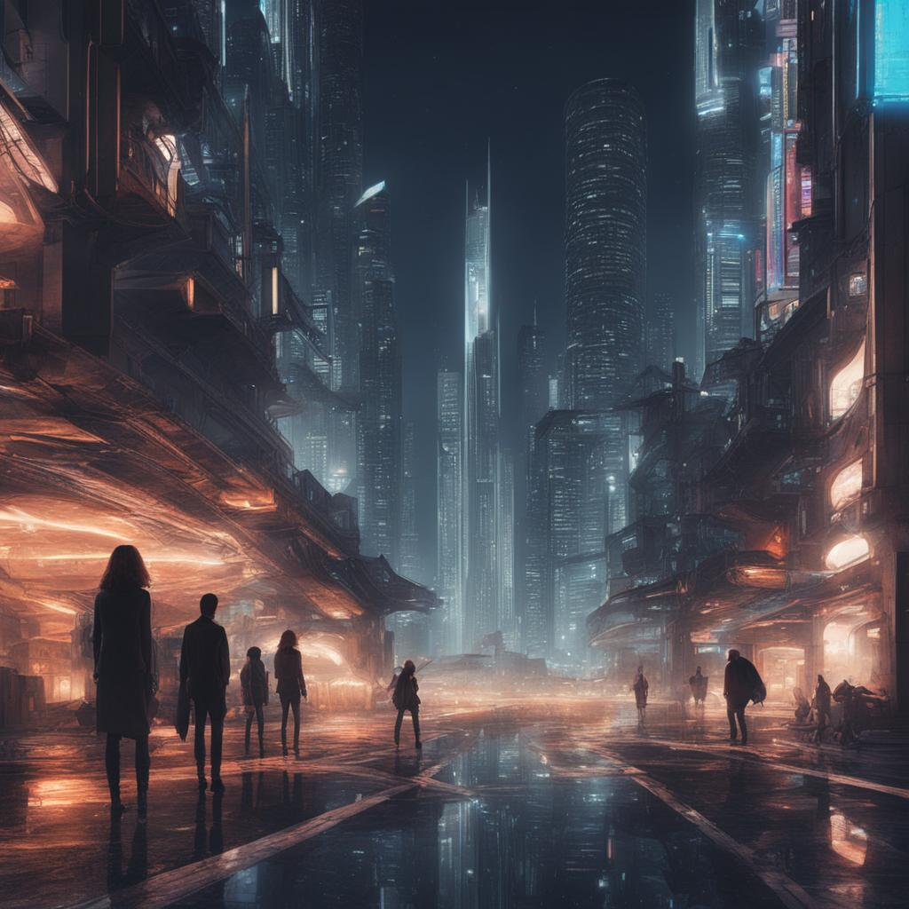
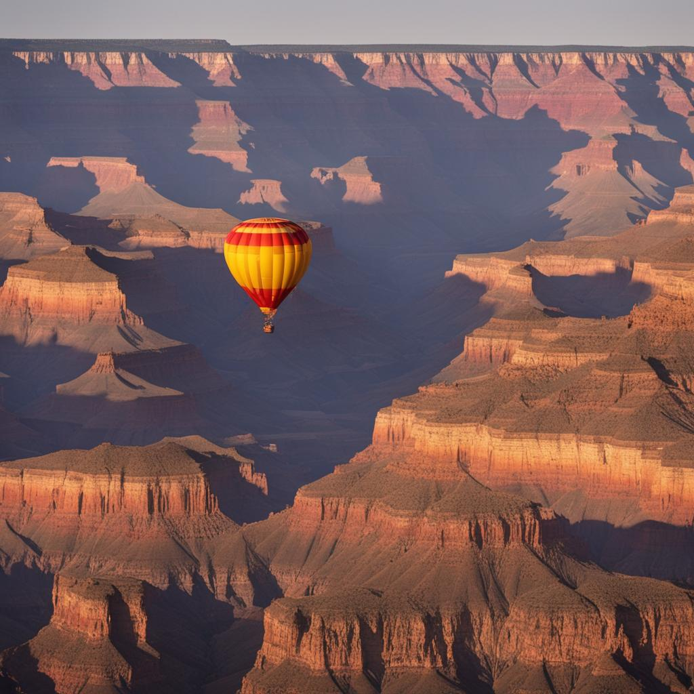

# 🌀 DLSF: Dual-Layer Synergistic Fusion for High-Fidelity Image Synthesis

### 🎤 Oral Presentation @ Machine Vision Application Conference 2025, Kyoto
- 📣 This paper has been selected for **Oral Presentation** at MVA 2025, Session **Oral 1-3: Image Synthesis and Generation**.
- 🗓️ **Presentation Time:** **July 26 (Saturday), 16:10 JST**
- 📍 We welcome you to join the talk and discussion!


> This repository provides the inference pipeline for **DLSF (Dual-Layer Synergistic Fusion)** — a novel framework that enhances image generation quality in **Stable Diffusion XL (SDXL)** through two complementary fusion strategies: **Adaptive Global Fusion (AGF)** and **Dynamic Spatial Fusion (DSF)**.

---

## 🌐 Project Links

- [📄 Paper]  |  [🔗 Project Page](https://rossi-laboratory.github.io/MVA2025/)  |  [🎞️ Video]  |  [💻 Code](https://github.com/Rossi-Laboratory/MVA2025)  |  [📖 Wiki](https://deepwiki.com/Rossi-Laboratory/MVA2025/)

---

## ✨ Highlights

- 🔁 Seamlessly fuses **base** and **refined** latents using learnable fusion modules.
- 🧠 AGF & DSF modules optimize both semantic alignment and spatial detail.
- 🖼️ Enables high-resolution (1024×1024) image generation via SDXL decoding.
- ⚡ Built on PyTorch and HuggingFace Diffusers with FP16 support.
- 📈 Outperforms SDXL in FID, IS, and Recall on ImageNet benchmarks.

---

## 🧠 Method Summary

While standard SDXL pipelines run base and refiner models independently, DLSF introduces latent-space fusion:

- **AGF (Adaptive Global Fusion)** — aligns features across semantic levels using learnable attention weights.
- **DSF (Dynamic Spatial Fusion)** — applies spatial attention to enhance pixel-level detail.

The fused latent is decoded by SDXL’s VAE into the final high-resolution image.

---

## 📁 Project Structure

```
DLSF-Inference/
├── DLSF_module.py            # Full pipeline: fusion + decoding + inference
├── evaluator.py              # Evaluation script (FID, IS, sFID, etc.)
├── requirements.txt          # Python dependency list
└── README.md                 # Project documentation
```

---

## 🚀 Running Inference

The DLSF pipeline enhances SDXL image generation by fusing base and refined latent representations using AGF or DSF. Here’s how it works:

1. **Model Loading** – Load SDXL base and refiner models from HuggingFace.
2. **Latent Generation** – Encode a text prompt into two latent feature maps.
3. **Latent Fusion** – Merge latents using AGF (semantic alignment) or DSF (spatial detail).
4. **Decoding** – Use the VAE to decode the fused latent into a 1024×1024 image.
5. **Postprocessing** – Apply optional watermarking and final image adjustments.
6. **Saving** – Output the result as a `.jpg` file.

---

### 1. Install Dependencies

Ensure Python 3.9+ is installed:

```bash
pip install -r requirements.txt
```

(Optional) For faster attention operations on GPU:

```bash
pip install xformers
```

---

### 2. Run and Customize the Script

Run the default inference setup:

```bash
python DLSF_module.py
```

- Default prompt and `"DSF"` strategy are used.
- Output saved as `output.jpg`.

To modify the prompt or strategy, open `DLSF_module.py` and edit:

```python
prompt = "your custom prompt here"
fusion = "AGF"  # or "DSF"
```

Save the file and re-run the script.

---

### 3. Use in Python Scripts

Import and run DLSF in your own workflow:

```python
from DLSF_module import run_dlsf_inference

image = run_dlsf_inference(
    prompt="a dragon-shaped hot air balloon flying over the Grand Canyon",
    fusion_type="AGF",  # or "DSF"
    device="cuda"       # or "cpu"
)
image.save("custom_output.jpg")
```

- `prompt`: text description of the target image
- `fusion_type`: "AGF" (semantic) or "DSF" (spatial detail)
- `device`: "cuda" recommended for GPUs

---

### 4. Internal Workflow

- **Load models** using `StableDiffusionPipeline`
- **Generate latents** from prompt (base + refined)
- **Fuse** latents using AGF or DSF
- **Decode** fused latent with SDXL’s VAE
- **Postprocess** and save the final image (1024×1024)

> 💡 Typical runtime: ~10 seconds per image on NVIDIA A6000.

---

## 🖼️ Output Samples

| Fusion | Prompt                                                     | Output                                      |
|--------|------------------------------------------------------------|---------------------------------------------|
| AGF    | *a futuristic cityscape at night*                          |  |
| DSF    | *a hot air balloon flying over the Grand Canyon at sunset*|  |

---

## 📊 Performance on ImageNet (Class-Conditional)

### 🔹 256×256 Resolution

| Method | FID ↓ | sFID ↓ | IS ↑    | Precision ↑ | Recall ↑ |
|--------|-------|--------|--------|--------------|-----------|
| SDXL   | 20.16 | 48.98  | 219.74 | 0.860        | 0.350     |
| AGF    | 18.79 | 47.64  | 230.43 | 0.870        | 0.390     |
| DSF    | 18.89 | 48.21  | 232.04 | 0.870        | 0.390     |

### 🔹 512×512 Resolution

| Method | FID ↓ | sFID ↓ | IS ↑    | Precision ↑ | Recall ↑ |
|--------|-------|--------|--------|--------------|-----------|
| SDXL   | 19.65 | 50.54  | 234.75 | 0.860        | 0.350     |
| AGF    | 18.70 | 49.77  | 243.48 | 0.852        | 0.381     |
| DSF    | 18.70 | 50.22  | 243.62 | 0.854        | 0.383     |

### 🔬 Ablation Study (512×512 with Refinement Step `/r`)

| Method     | FID ↓ | sFID ↓ | IS ↑    | Precision ↑ | Recall ↑ |
|------------|-------|--------|--------|--------------|-----------|
| AGF        | 18.70 | 49.77  | 243.48 | 0.852        | 0.381     |
| AGF /r     | 20.02 | 53.94  | 215.06 | 0.851        | 0.363     |
| DSF        | 18.70 | 50.22  | 243.62 | 0.854        | 0.383     |
| DSF /r     | 19.89 | 54.28  | 218.36 | 0.853        | 0.383     |

---

## 💻 Environment

- Python 3.9+
- PyTorch ≥ 2.0
- GPU: NVIDIA A6000 or GPU with ≥24GB VRAM
- Recommended: `diffusers==0.24.0`, `xformers` (optional)

---

## 📚 Citation

```bibtex
@inproceedings{DLSF2025,
  title={DLSF: Dual-Layer Synergistic Fusion for High-Fidelity Image Synthesis},
  year={2025}
}
```

---

## 🔮 Future Work

- Extending to video and 3D generation
- Applications in medical imaging, remote sensing
- Open-sourcing the training pipeline
